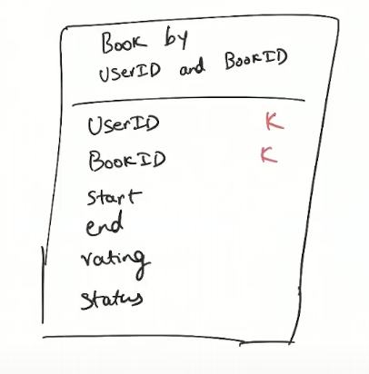

# BetterReads-Spring-Boot-Cassandra-HA-and-large-scale-app
Built an enterprise grade application that is highly available, scalable to millions of users, can handle large amounts of data and is highly performant with low latency.

This is a end-to-end Spring Boot book tracking application with a vast database on all the books built using Java Spring Boot and Cassandra which allows the user to track the book they are currently reading or have read, give ratings and reviews, have access to a vast catalog of all published books and more.

### Technologies used:
- Cassandra
    - Motivation: To build for scalability, performance and reliability that Cassandra provides, this app is supposed to be highly performant even with a large number of users, therefore I used Cassandra because:
        - its a NoSQL DB so we don't have to do sacrifice performance in expenisve joins as our dataset is vast, suppots key-based lookup
        - store metadata on millions of books
        - very flexible, document store
        - scales up or down elastically based on the load
        - a distributed database, bunch of nodes in a cluster which makes it reliable, fault tolerant and scalable
    - using a hosted Cassandra instance via AstraDB by DataStacks
- Spring Boot
- Spring Security:
    - For a OAuth login via Github functionality
- ThymeLeaf
- Spring Data for Apache Cassandra:
    - To get the use of model based interactions, repository patterns similar to Spring JPA

### Data source
https://openlibrary.org/developers/dumps
https://openlibrary.org/developers/api

# HDD
## 1. User Experience
Let's first identify the UX, because it gives a good idea about:
- overall flow of the app
- the type of data that we will deal with, how will we retrieve them in common usage patterns, common queries that we need to perform efficiently so we need to optimize the structure of the data model (because unlike a RDBMS where we can have normalized tables and we can focus on the app first and not worry about efficieny of queries, here in a NoSQL document datastore we have more flexibiity of data schemas so we must identify optimal structure then build the application around the data structure for efficient querying)

**What functionality should the app provide to the users?**
- Home page for logged out users:
    - A search bar to browse the book catalog
    - A login via Github button
- Home page for logged in users:
    - A list of last 50 books read in reverse chronological order
- Book page which provides:
    - An image of the book cover
    - Title and Description of the book
    - A link to the Author's page for this book
    - Information related to the user such as:
        - Start date
        - End date
        - Rating
        - Status
- Author page which provides:
    - Profile of the author
    - A list of books in reverse chronological order that the author has published
- Search page:
    - search by title
    - search by author

## 2. System Design
**Some non-functional requirements/goals that we want to achieve in our application:**
1. Should be performant
2. Can handle large data
3. Reliable, HA
4. Backend Focussed (personal goal, not wasting time with CSS for now, will do that later in free time)

**Architecture:**
- **Spring Boot** backend with Spring MVC to serve HTML pages to users
- **Spring Security** for login
- A non relational database for high performance and reliablity as RDBMS are single store so no fault tolerance, so we use **Apache Cassandra** a reliable NoSQl, performant database for large data.
- **Spring Data for Apache Cassandra** to connect to DB
- **Open Library API** for search functionality (Apache is not meant to be used for full table searches, it allows lookup of data but not fast 'like' queries similar to RDBMS, to search in Cassandra we can use Apache Lucene for indexes but I will make one exception and implement it later(maybe) as it will add lot of complexity)

## 3. Application Architecture

*Architecure Diagram (built on eraser.io)*

To optimze for low latency, we identify bottlenecks, this applications's latency is going to be directly correlated with the database's latency, so the only optimizable latency arises from retrieving information from the database. This is our bottleneck. So we will design the schemas in such a way that looking up data will be really performant.

How to ensure reliablity?
Apache Cassandra is a super reliable database, becaues its not just a single node, it runs multiple nodes in a cluster and synchronizes them, so we have a reliable data store. And for our application's reliability, we will create a stateless application apart from the login session in Spring Security, so when load increases we can just spin up mulitple spring boot instances and have a firewall at the gateway for load balancing and all of them will connect to the same db cluster, so this is also accounting for scalability. Only uncertainity in reliablity is coming from the Open Library Search API which we anticipate to be performant and reliable.

## 4. Data Modelling

### Entity Relationship Model
1. Book:
    - date
    - id
    - name
    - desc
    - cover 
2. Author:
    - id
    - name
    - img
3. User:
    - id
    - name
4. User_Book
    - status
    - start_date
    - end_date
    - rating

*Entity Relationship Model (rough)*

### What are the queries we need to perform on our Cassandra database and their Chebotko Diagrams for identifying the keys, sorting order, clustering info, etc:
**⭐️ In Cassandra primary keys are hashed to a value which decides which partition to store the object into**
1. `books_by_id()`
`book_id` -> Primary key -> 1 record partition

we won't have a authorId as a foreign key because this isn't a relational storage, we dont relate authorId with books by performing joins, because first joins are inefficient in large data and second we have duplicatitions

2. `books_by_authorId()`

`authorId` -> Primary Key -> many record partition
**⭐️ Store all the books by a single author in the same partition to optimize fetching**
`published_date` -> make it into a clustering column so that its stored sorted, and we dont need to sort it at runtime

3. `userBooks_by_bookId_and_userId()`
`userId` and `bookId` -> Primary key

4. `userBooks_by_userId()`
`userId` -> Primary key

We only care about how we fetch the data not how the data is stored in its ideal state because the data will be replicated and we have large amounts of data

Some considerations:
1. Is it possible for there to be too many books in one partition or hotspots in our parittioning strategy?
Ans: Realistitcally speaking one author cannot write so many books that it overloads our partition and a reader (user) cannot read so many books either even though people do read lots of books but its isn't much here, so unless there is a malicious actor try to overload a partiiton by garbage data (which can be prevented by adding some application controls to handlle that, rate limiting) there should not be hotspots.
2. What if in the future we have a lot more users and hotspots start to occur?
Ans: We can solve this by having a new data element such as `year` and partition based on that to ensure almost consistent partition, more sophisticated partition strategies can be developed as well.